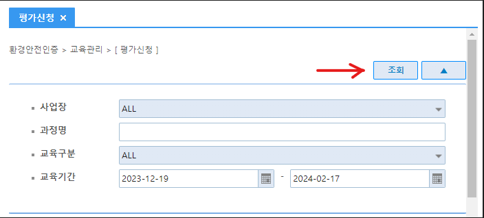

반갑습니다

#1. 교육자료
==

[https://1drv.ms/b/s!AvcoqK73BVI34xvKLJs55HNS5nI7](https://1drv.ms/b/s!AvcoqK73BVI34xvKLJs55HNS5nI7)

오피스에서 교육했던 교육 자료는

위 링크 참조하시기 바랍니다.

#2. P-EHS 시험 
==

삼성디스플레이에서

위와같은 카톡이 오면

[https://green.samsungdisplay.com/login.jsp](https://green.samsungdisplay.com/login.jsp)

본인의 ID로 P-EHS 사이트에 접속하여

평가신청을 들어간 뒤

해당 화면에서 '조회' 버튼을

클릭하여 나오는 리스트에서

이 부분의 시험응시 버튼이

'합격' 이 될 때까지 시험 응시.

#3. 시험 합격 후
==

P-EHS 시스템에서

아래와 같은 카톡이 발송됨.

이력관리를 위하여

해당 화면 캡처해서

단톡방에 올려주시면 됩니다.

